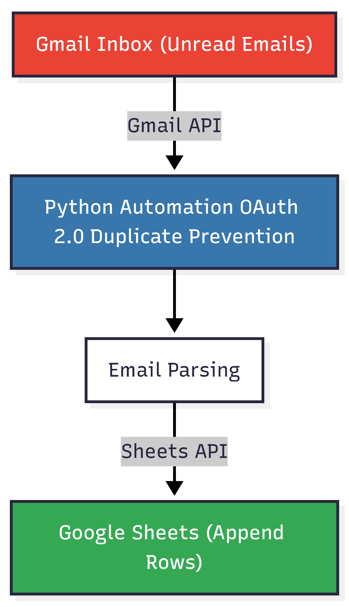
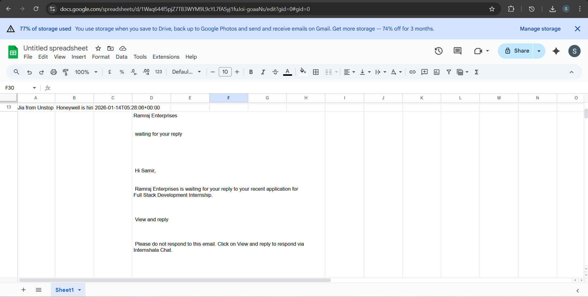
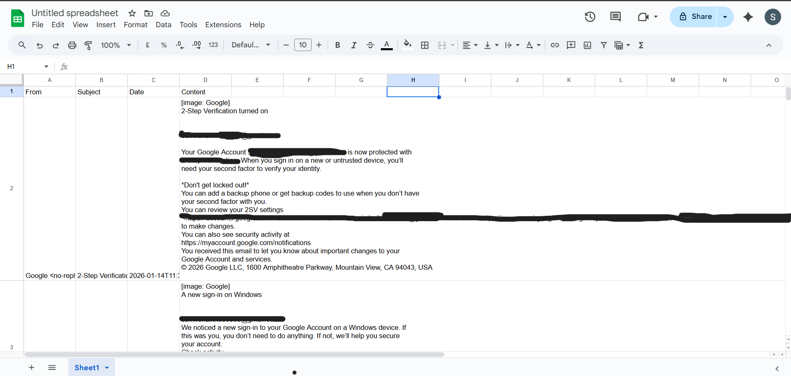
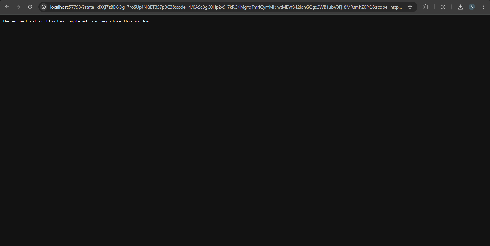

# Gmail to Google Sheets Automation

**Author:** Samir Jamil Shaikh  
**Project Type:** Backend Automation (Python)  
**APIs Used:** Gmail API, Google Sheets API  

---

##  Project Overview

This project is a Python-based automation system that reads **real unread emails** from a Gmail inbox and logs them into a **Google Sheet**.  
Each qualifying email is appended as a new row containing sender details, subject, timestamp, and plain-text content.

The system uses **OAuth 2.0 authentication** (Installed App flow) and ensures that **no duplicate emails** are logged, even if the script is run multiple times.

---

##  Objective

For every unread email in the Gmail Inbox, the script records the following fields in Google Sheets:

| Column | Description |
|------|-------------|
| From | Sender email address |
| Subject | Email subject |
| Date | Date & time received |
| Content | Plain-text email body |

---

##  High-Level Architecture

<p align="center">
  
</p>

This diagram illustrates the end-to-end flow of the system, showing how unread emails
are fetched from Gmail, processed by the Python automation layer, and appended
to Google Sheets using Google APIs.

---

##  Project Structure

```
gmail-to-sheets/
├─ src/                     # Application source code
│  ├─ main.py               # Entry point
│  ├─ gmail_service.py      # Gmail API authentication & fetch logic
│  ├─ sheets_service.py     # Google Sheets integration
│  ├─ email_parser.py       # Email content extraction
│  └─ config.py             # Configurations (Sheet ID, scopes)
│
├─ credentials/             # OAuth files (ignored by git)
│  └─ credentials.json
│
├─ state/                   # Stores processed Gmail message IDs
│  └─ processed_ids.json
│
├─ proof/                   # Execution proof
│  ├─ gmail_inbox.png
│  ├─ google_sheet.png
│  └─ oauth_consent.png
│
├─ .gitignore
├─ requirements.txt
└─ README.md
```

---

### 1. Create Virtual Environment
```bash
python -m venv venv
venv\Scripts\activate
```

### 2. Google Cloud Setup

1. Create a Google Cloud project

2. Enable:
    - Gmail API
    - Google Sheets API

3. Configure OAuth Consent Screen:
    - User Type: External

    - Add your Gmail as a Test User

4. Create OAuth Client:

    - Application type: Desktop App

5. Download credentials.json and place it in:

   `credentials/credentials.json`

### 3. Configure Spreadsheet

- Create a Google Sheet

- Copy the Spreadsheet ID from the URL

- Paste it into config.py

- Ensure the sheet name matches exactly

### 4. Run the Script
```python src/main.py```

On first run:

- Browser opens for OAuth

- Permissions are granted

- Token is stored locally

On subsequent runs:

- No OAuth prompt

- Only new emails are processed

---

##  OAuth Flow Explanation

This project uses OAuth 2.0 Installed App Flow:

- Suitable for local scripts

- No public redirect URLs required

- Tokens are stored locally (token.pickle)

- No service accounts are used

This approach is ideal for personal Gmail access and development/testing scenarios.

---
##  Duplicate Prevention Logic

Duplicate emails are prevented using Gmail Message IDs:

- Each Gmail email has a unique immutable ID

- After processing an email, its ID is saved in: `state/processed_ids.json`

- On subsequent runs:

   - The script checks this file

   - Skips emails that were already processed

This ensures idempotent behavior.

---

##  State Persistence Method
State is persisted using a local JSON file:   `["18c3a7f8a9d2babc", "18c3a7f8a9d2bbbb"]`

---

## Execution Overview

This section demonstrates that the system was executed successfully in a real environment using a live Gmail account and an active Google Sheet.

All evidence is provided in the `/proof` directory and validates end-to-end functionality, authentication flow, and data persistence behavior.

---

### 1️. Gmail Inbox Processing

**File:** `proof/gmail_inbox.png`


This screenshot shows the Gmail inbox **before and after execution**, highlighting unread emails that were processed by the automation.

**Validated behavior:**
- Only emails from the **Inbox** were considered
- Only **unread emails** were processed
- Emails were **marked as read** after successful logging
- No previously processed emails were re-read

---

### 2️. Google Sheets Data Logging

**File:** `proof/google_sheet.png`


This screenshot confirms that email data was correctly appended to the Google Sheet as new rows.

**Validated behavior:**
- Each email is logged as a **single row**
- Columns include sender, subject, timestamp, and content
- Existing rows remain unchanged
- No duplicate entries are created on re-execution

---

### 3️. OAuth 2.0 Authentication Flow

**File:** `proof/oauth_consent.png`


This screenshot captures the OAuth consent screen used during first-time authentication.

**Validated behavior:**
- OAuth 2.0 Installed App flow was used
- No API keys or service accounts were involved
- Access was granted explicitly by the user
- Tokens were stored locally and reused securely

---

### 4️. Idempotency Verification

To validate idempotent behavior, the script was executed multiple times without resetting state.

**Observed result:**
- No duplicate rows were added
- Only newly received emails were processed
- Previously processed emails were skipped based on stored state

This confirms correct implementation of state persistence and duplicate prevention logic.

---

### Summary

The provided proof demonstrates that the automation:
- Operates on real production services (Gmail & Google Sheets)
- Authenticates securely using OAuth 2.0
- Maintains data integrity across executions
- Behaves predictably and safely when re-run

---
# Challenges Faced & Solutions
### Challenge:

Understanding OAuth errors and access restrictions during development.

### Solution:

Added the developer Gmail account as a Test User and used OAuth Installed App flow instead of Web App flow.

---

# Conclusion

This project demonstrates:

- Secure OAuth 2.0 integration

- API-driven automation

- State persistence

- Clean code organization

- Real-world backend problem solving


